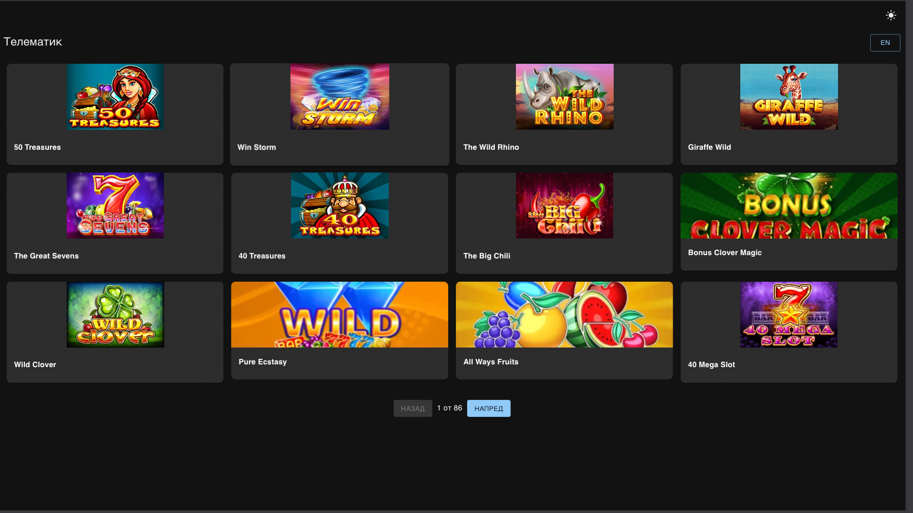

# 🎰 Casino Games - Next.js 14 & React 18



A **Next.js 14 & React 18** application that displays casino games with responsive design, pagination, dark mode, and localization.

## 🚀 Features

- 🔥 **Built with Next.js 14 & React 18**
- 🎨 **Dark Mode & Light Mode Toggle**
- 🌍 **Multi-language support (English & Bulgarian)**
- 📱 **Fully responsive design**
- 🏎️ **Optimized image loading with `next/image`**
- 🔍 **Pagination for better performance**
- ✅ **Unit tested with Jest & React Testing Library**

---

## ⚡ Tech Stack

- [Next.js 14](https://nextjs.org/)
- [React 18](https://react.dev/)
- [Material UI v5](https://mui.com/)
- [Styled Components](https://styled-components.com/)
- [next-i18next](https://github.com/i18next/next-i18next) (Localization)
- [React Testing Library](https://testing-library.com/)
- [Jest](https://jestjs.io/) (Unit Testing)

---

## 📥 Installation & Setup

### 1️⃣ Clone the Repository

```sh
git clone https://github.com/IvoTsochev/telematic.git
cd telematic
```

### 2️⃣ Install Dependencies

```sh
npm install
```

### 3️⃣ Run the Development Server

```sh
npm run dev
```

Then, open [http://localhost:3000](http://localhost:3000) in your browser.

---

---

## ✅ Running Tests

```sh
npm test -- --all
```

---

## 📸 Screenshot

You can find the latest screenshot of the app in the `/public/` directory.

---

## 📜 License

This project is **open-source** and available under the [MIT License](LICENSE).
